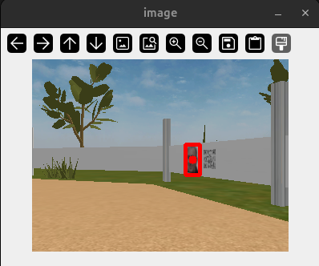
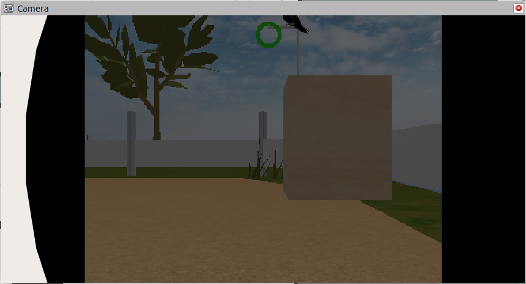
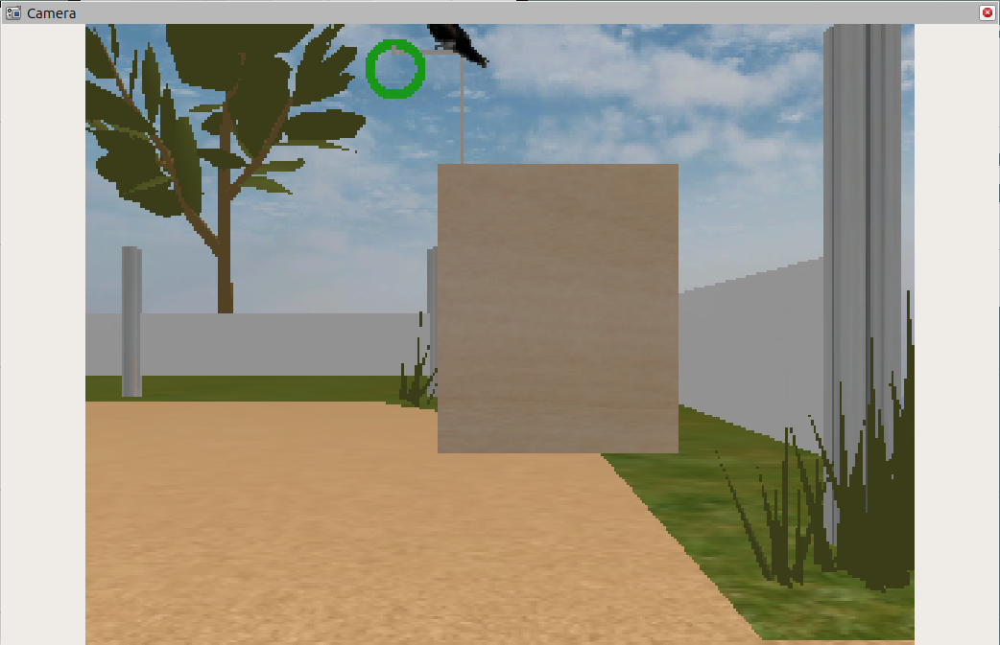
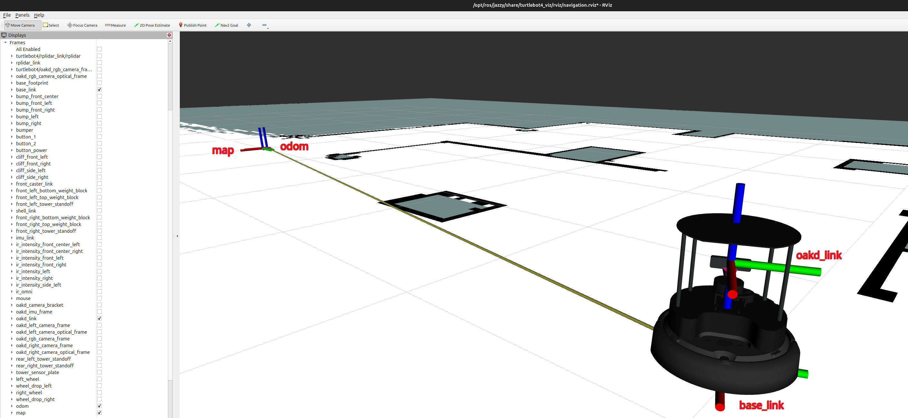
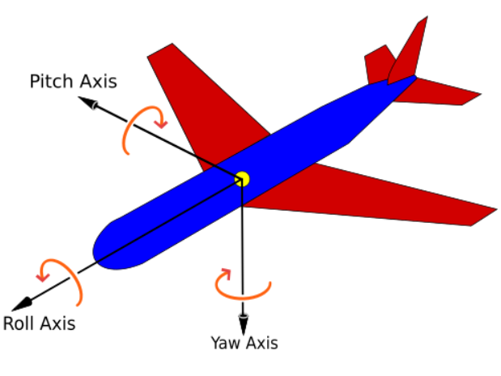
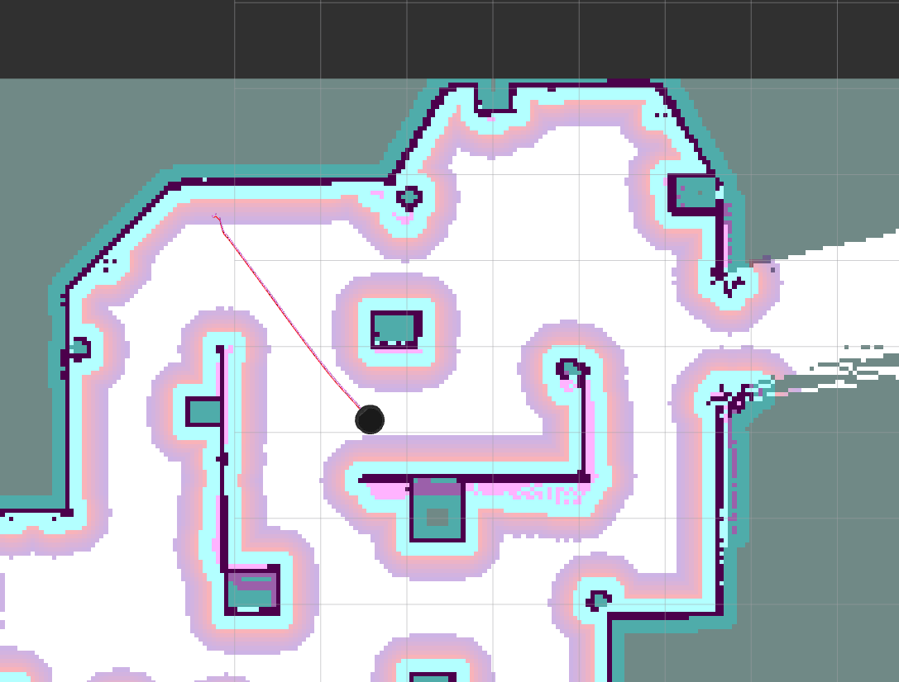

# Tutorial 3: The Turtlebot 4

#### Development of Intelligent Systems, 2026

In this exercise, you will familiarize yourself with the Turtlebot 4 robot platform that you will be using throughout the course for practical work. The robot is composed of the:
1. **iRobot Create 3** platform (based on the Roomba i-series vacuum cleaners)
2. **Luxonis Oak-D Pro** stereo camera depth sensor (only in the sim)
3. **Slamtec RPLIDAR-A1 2D** triangulation lidar sensor
4. **Raspberry Pi 4 SBC** with a Turtlebot HAT board


*Image source: [Clearpath Robotics](https://turtlebot.github.io/turtlebot4-user-manual/overview/features.html)*

You can use [the official TB4 manual](https://turtlebot.github.io/turtlebot4-user-manual/) as a reference guide.

## Turtlebot 4 Simulator Installation

Here we present the steps needed for installing the Turtlebot 4 packages on a native Ubuntu 24.04 + ROS 2 Jazzy. For WSL/pixi/Docker installation you will need to check the instructions linked above, and possible other sources. Lab PCs are already preinstalled with everything you need.

1. Install Turtlebot related packages and the Zenoh middleware:
```bash
sudo apt update && sudo apt install curl \
ros-jazzy-turtlebot4-simulator \
ros-jazzy-irobot-create-nodes \
ros-jazzy-turtlebot4-description \
ros-jazzy-turtlebot4-msgs \
ros-jazzy-turtlebot4-navigation \
ros-jazzy-turtlebot4-node \
ros-jazzy-rmw-zenoh-cpp \
ros-jazzy-laser-filters \
ros-jazzy-teleop-twist-keyboard
```
2. Install Gazebo Harmonic:
```bash
sudo curl https://packages.osrfoundation.org/gazebo.gpg --output /usr/share/keyrings/pkgs-osrf-archive-keyring.gpg
echo "deb [arch=$(dpkg --print-architecture) signed-by=/usr/share/keyrings/pkgs-osrf-archive-keyring.gpg] http://packages.osrfoundation.org/gazebo/ubuntu-stable $(lsb_release -cs) main" | sudo tee /etc/apt/sources.list.d/gazebo-stable.list > /dev/null
sudo apt update && sudo apt install gz-harmonic
```

3. Clone and build `dis_tutorial3`, i.e. this repo:

```bash
cd ~/colcon_ws/src
git clone https://github.com/vicoslab/dis_tutorial3.git
cd ..
colcon build --symlink-install
```

## Running the simulation

### Setup

For the simulation setup, we'll be using the [Zenoh RMW](https://docs.ros.org/en/jazzy/Installation/RMW-Implementations/Non-DDS-Implementations/Working-with-Zenoh.html) which was installed amongst the packages above. To enable it and configure Gazebo environment variables, add the following lines to your `.bashrc` file:

```bash
export RMW_IMPLEMENTATION=rmw_zenoh_cpp
export GZ_VERSION=harmonic
export IGN_IP=127.0.0.1
```

Then restart any existing terminal windows and start the router:

```bash
pkill -9 -f ros && ros2 daemon stop
ros2 run rmw_zenoh_cpp rmw_zenohd
```

By default, the router will only relay data between nodes on localhost. For more advanced configurations, see the [github documentation](https://github.com/ros2/rmw_zenoh?tab=readme-ov-file#configuration).


### Run SLAM


Our ultimate goal is to have the robot navigate autonomously. The first step towards this capability is to build a map of the working environment of the robot. For building a map we will use the slam_toolbox package which builds a map based on the lidar data and the odometry data from the robot movement. 

Now close all the running nodes and launch the Turtlebot 4 simulation + SLAM + rviz. Open a new terminal and run:

```bash
ros2 launch dis_tutorial3 sim_turtlebot_slam.launch.py
```

This will start the necessary nodes for building a map. You should see the Ignition Gazebo Fortress simulator with a custom GUI for the Turtlebot4, and the RViz tool.


### Running the simulation without a GPU

If you do not have a dedicated GPU the simulation might run slow. If the Real Time Factor (RTF) in the bottom right of Ignition Gazebo is more than 30-40% this should be enough to use the simulation normally. The problem is, that Ignition Gazebo (inlike Gazebo classic) only supports the `gpu_laser` plugin to simulate the lidar sensor which in the absence of a dedicated GPU does not generate ranges. You can tell that this is an issue if you start `sim_turtlebot_slam.launch.py` and in RViz you do not see the laser or the map that is being built. Luckily, there is a workaround to force the `gpu_laser` plugin to use CPU for rendering. You need to set up `MESA_GL_VERSION_OVERRIDE=3.3` and `LIBGL_ALWAYS_SOFTWARE=true` in your .bashrc file. For example, the last few lines of my .bashrc look like this:
```bash
export MESA_GL_VERSION_OVERRIDE=3.3 # 1. Hack for laser simulation
export LIBGL_ALWAYS_SOFTWARE=true # 2. Hack for laser simulation

source /opt/ros/jazzy/setup.bash  # Load the ROS installation and packages
source /home/username/colcon_ws/install/setup.bash # Load the packages from my workspace
```

If this did not work, see next subsection:

---

### Fix: Lidar simulation on Intel integrated GPU (e.g. Intel Iris Xe)

If you have an Intel integrated GPU (not a dedicated NVIDIA/AMD GPU), the lidar will not produce data in RViz by default. The Gazebo Sim `gpu_lidar` sensor plugin requires the **Ogre 2.x** (ogre2) rendering engine, but the default configuration uses **Ogre 1.x** (ogre), which cannot render GPU lidar.

#### 1. Set `MESA_GL_VERSION_OVERRIDE` in `~/.bashrc`

Add this line to your `~/.bashrc` (before the ROS `source` lines):

```bash
export MESA_GL_VERSION_OVERRIDE=3.3
```

> **Note:** Do **NOT** set `LIBGL_ALWAYS_SOFTWARE=true` if you have an Intel Iris Xe or similar integrated GPU. That variable forces pure CPU software rendering, which will cause Gazebo to crash with a segfault in `libgallium`. It is only needed on machines with truly no GPU at all.

#### 2. Change the render engine in the iRobot Create3 URDF

The file `/opt/ros/jazzy/share/irobot_create_description/urdf/create3.urdf.xacro` contains a Sensors system plugin that hardcodes `ogre` as the render engine. Change it to `ogre2`:

```bash
sudo sed -i 's/<render_engine>ogre<\/render_engine>/<render_engine>ogre2<\/render_engine>/' \
  /opt/ros/jazzy/share/irobot_create_description/urdf/create3.urdf.xacro
```

You can verify the change:
```bash
grep render_engine /opt/ros/jazzy/share/irobot_create_description/urdf/create3.urdf.xacro
# Should output: <render_engine>ogre2</render_engine>
```

#### 3. Make sure the world SDF files do NOT include a duplicate Sensors plugin

If you previously added a `gz::sim::systems::Sensors` plugin to the world `.sdf` files (e.g. `bird_demo1.sdf`), **remove it**. Having two Sensors system plugins (one in the world, one in the robot URDF) causes an Ogre2 material hash collision crash:

```
OGRE EXCEPTION(4:ItemIdentityException): A material datablock with name '[Hash ...]' already exists.
```

The robot URDF (`create3.urdf.xacro`) already includes the Sensors plugin — the world files should only have Physics, UserCommands, SceneBroadcaster, and Contact.

#### 4. Rebuild and relaunch

```bash
cd ~/colcon_ws
colcon build --symlink-install --packages-select dis_tutorial3
source ~/.bashrc

# Kill leftover processes
bash ~/colcon_ws/src/dis_tutorial3/kill_ros_processes.sh

# Terminal 1:
ros2 run rmw_zenoh_cpp rmw_zenohd

# Terminal 2:
ros2 launch dis_tutorial3 sim_turtlebot_slam.launch.py
```

You should now see `Loading plugin [gz-rendering-ogre2]` in the Gazebo logs for both the GUI and the sensor rendering thread, and the lidar scan data should appear in RViz.

---

### DPI Scaling

In case you see Rviz2 or Gazebo flicker, you add the following in your .bashrc file to disable scaling:

```bash
unset QT_SCREEN_SCALE_FACTORS
```

### Restarting the sim

ROS 2 does not track its own processes and many additional ones like gazebo gui and server will fork and might remain active after the launch file is closed, so we've provided a `kill_ros_processes.sh` script that should clean up anything still running from a previous session.

### Building a map

To build the map we should move the robot around the course using the teleop node:

```bash
ros2 run teleop_twist_keyboard teleop_twist_keyboard --ros-args -p stamped:=true
```
You can also use the the GUI in Gazebo:


Now move about the course until you get a relatively good map. To build a good map:
- Move the robot slowly. When the robot is moving quickly it can lose the connection between individual scans or build up too much odometry error between map updates.
- Observe the current state that is shown in Rviz. The map is not refreshed in real time but rather in steps therefore make sure that the map has indeed been updated before moving on.

Once you are satisfied with the map you can save it by executing:

```bash
ros2 run nav2_map_server map_saver_cli -f ~/path/to/your/map
```

Do not add any extensions to the name of your map, as the map_saver will create two different files for storing map data. The first one is a `.yaml` file containing the name of the image for the map, the origin of the image, the metric length of a pixel in the map and the thresholds for occupied and free space. The other file is a `.pgm` image file (portable gray map) which you can open in most image editors. This is useful for fixing minor imperfections. 

When you have built a good enough map, close all running nodes.

#### Renaming saved maps

If you want to rename a map you must modify the .yaml file as well, since it contains the .pgm name:

**bird_demo.yaml**
```yaml
image: bird_demo.pgm
mode: trinary
resolution: 0.050
origin: [-4.466, -8.077, 0]
negate: 0
occupied_thresh: 0.65
free_thresh: 0.196
```

### Navigation

The Turtlebot 4 uses Nav2 which provides perception, planning, control, localization, visualization, and much more to build autonomous systems. This will compute an environmental model from sensor and semantic data, dynamically path plan, compute velocities for motors, avoid obstacles, and structure higher-level robot behaviors. You can find more info about Nav2 [here](https://navigation.ros.org/).

If you have built a map of the course, we are finally ready to let the robot drive on its own. In one terminal start the simulation (THIS STARTS THE SERVER THAT PUBLISHES THE MAP):

```bash
ros2 launch dis_tutorial3 sim_turtlebot_nav.launch.py
```

And in another:
```bash
ros2 run rmw_zenoh_cpp rmw_zenohd
```

You should see RViz with the already loaded map:


You can load your own custom map by modifying the `sim_turtlebot_nav.launch.py` launch file:

```python
DeclareLaunchArgument(
    'map',
    default_value=PathJoinSubstitution([pkg_dis_tutorial3, 'maps', 'map.yaml']), #concats location of the given package and subfolder
    description='Full path to map yaml file to load'
)
```

You can also set parameter in the command line instead, e.g. `ros2 launch dis_tutorial3 sim_turtlebot_nav.launch.py map:=/home/user/rins/map.yaml`. 


Now the RViz will show the saved map, but it does not know where the robot is located. To activate localization system by adding robot's initial pose, we use the '2D Pose Estimate' option in the ribbon in RViz. Choose the location where robot is (look at Gazebo Sim) and in which direction it looks (drag arrow in this direction). Once you do, the robot will create Controller > Local Costmap and the localization will enable us to use navigation.
You can send navigation goal to the robot from RViz. In RViz window ribbon use the 'Nav2 Goal'.


### Testing with different positions of faces

There are various worlds from previous years in this repository which you can explore to get a feel for what to expect: 
- `empty.sdf`
- `dis.sdf`
- `task1.sdf`
- `task2.sdf`
- `demo1.sdf`
- `demo2.sdf`
- `demo3.sdf`
- `demo4.sdf`
- `bird_demo1.sdf`
- `bird_demo2.sdf`
- `bird_demo3.sdf`

The default world is currently set to `bird_demo1`. To load a different world, you can add the `world` argument in the `launch` command without any prefix e.g.:

```bash
ros2 launch dis_tutorial3 sim_turtlebot_slam.launch.py world:=demo1
```

You can also change the `default_value` of the `world` in the `.launch` file itself, for example in `sim_turtlebot_slam.launch.py`:

```python
DeclareLaunchArgument('world', default_value='demo1', description='Ignition World'),
```

### Face Detection and Localization

As part of Task 1, you need to detect the faces in the course. The easiest way to run YOLO models is using the [Ultralytics](https://www.ultralytics.com/) python packages. 

On the lab PCs, we've preinstalled a virtual environment with all needed packages, which you can source using:
```bash
source /opt/ultralytics/bin/activate
```

On your own machines you can install ultralytics and its dependencies using:

```bash
# ROS packages are generally designed to work with apt versions of python packages
sudo apt install python3-pip python3-opencv python3-numpy ros-jazzy-cv-bridge

# we need ultralytics from pip, since it's not on apt, which adds an overlay of some additional pip packages
pip install ultralytics --break-system-packages

# remove pip's numpy 2.4.2, since it breaks opencv ROS compatibility, this reverts back to using numpy 1.26.4 from apt which will work fine
pip uninstall numpy --break-system-packages
```

Then run the person detector node, which sends a marker to RViz at the detected locations:

```bash
ros2 run dis_tutorial3 detect_people.py
```

If it fails with segfault due to NumPy version conflict, then run:
- `pip uninstall numpy --break-system-packages`
- `python3 -c "import numpy; print(numpy.__version__)"` should return `1.26.4`
- rerun: `ros2 run dis_tutorial3 detect_people.py`

This node uses a pretrained YOLOv8 model. It can detect many different categories, but we are only using the "person" category.



### Camera view in RViz

To get camera view in RViz, go in 'Displays' menu and click 'Add', then go into 'By topic', then find the '/oakd', then '/rgb' and '/preview' and choose '/image_raw' and 'Camera' (if it is too demanding for your computer, then when viewing Camera, turn off the LaserScan, GlobalPlanner, Controller).

If you see your Camera image dimmed like this:



then you should:
- go to `urdf/sensors/oakd.urdf.xacro` file
- find the line that sets RGB camera joint on the robot in simulation: 
```xml
<joint name="${name}_rgb_camera_joint" type="fixed">
  <parent link="${base_frame}"/>
  <child link="${name}_rgb_camera_frame"/>
  <origin xyz="0 0 0" rpy="0 0 0" />
</joint>
```
and change the origin xyz coordinates to move camera up:
```xml
<joint name="${name}_rgb_camera_joint" type="fixed">
  <parent link="${base_frame}"/>
  <child link="${name}_rgb_camera_frame"/>
  <origin xyz="0 -0.25 0" rpy="0 0 0" />
</joint>
```
- then you should get this:




### Sending movement goals from a node

In the `robot_commander.py` node you have examples of how to programatically send navigation goals to the robot. Explore the code after running it:
```bash
ros2 run dis_tutorial3 robot_commander.py
```

If you get the error:
```
Traceback (most recent call last):
File "/home/erik/rins/install/dis_tutorial3/lib/dis_tutorial3/robot_commander.py", line 25, in <module>
from turtle_tf2_py.turtle_tf2_broadcaster import quaternion_from_euler
ModuleNotFoundError: No module named 'turtle_tf2_py'
[ros2run]: Process exited with failure 1
```
just install via:
- `sudo apt install -y ros-${ROS_DISTRO}-turtle-tf2-py 2>&1`
- rerun: `ros2 run dis_tutorial3 robot_commander.py`

<br>

# Homework 3

Build a map of the course and save it to the disk. Then, load the map and drive the robot around, detect faces and save their positions. Finally, write a script that moves the robot between the positions of the detected faces (you can modify the `robot_commander.py` script for that).

### Build & save map:
- t1: `ros2 run rmw_zenoh_cpp rmw_zenohd`
- t2: `ros2 launch dis_tutorial3 sim_turtlebot_slam.launch.py`
- go with robot through map so that its lidar gets good map
- save map in t3: `ros2 run nav2_map_server map_saver_cli -f ~/rins/src/dis_tutorial3/maps/map.yaml`
- close all running nodes

### Save face positions:
- t1: `ros2 run rmw_zenoh_cpp rmw_zenohd`
- start server that publishes the map in t2 (SPECIFY CORRECT PATH TO MAP FILE): `ros2 launch dis_tutorial3 sim_turtlebot_nav.launch.py map:=/home/<user>/rins/src/dis_tutorial3/maps/map.yaml`
- in RViz do '2D Pose Estimate'
- t3: `ros2 run dis_tutorial3 detect_people.py` (or use improved `detect_people2.py` from tutorial4)
- save position of face:
  - in RViz Displays menu click 'Add' > 'By topic' and find topic `/people_marker` (`/people_marker_array`) and click on Marker and 'OK' to add it
  - we see that the `detect_people.py` file is subscribed to two topics:
    - `/oakd/rgb/preview/image_raw`, which gets the image from robot's camera
    - `/oakd/rgb/preview/depth/points`, which creates the marker for detected face by using coordinates relative to the robot camera and publishes it on topic `/people_marker`
  - we need to obtain the robot position in global map coordinates so that we can then calculate global coordinates of the detected face

  | Concept | What it is | Explanation |
  |---|---|---|
  | (coordinate) frame | reference coordinate system with origin and three axes (x,y,z) | every position, orientation, velocity etc. is always defined relative to some frame |
  | `map` frame | global map coordinate system | usually only frame that does not move |
  | `odom` frame | odometry frame | fixed to where the robot started, useful for local navigation |
  | `base_link` frame | robot's body frame (its center) | moves with the robot |
  | `oakd_rgb_camera_optical_frame` | camera module's 3D coordinate system | NOTE: for RGB sensor see `oakd_rgb_camera_frame` or `oakd_rgb_camera_optical_frame` |
  | `rpidar_link` frame | RPLidar coordinate system ||
  | `/tf` topic | publishes dynamic transformations between coordinate frames | `TransformStamped` message (`tf2_msgs/msg/TFMessage`) that describes how to convert coords from one frame to another|
  | `/tf_static` topic | publishes static transforms that rarely change | examples: distance/rotation between laser scanner and `base_link`, camera offset from `base_link`, all fixed frame relationships that are set up at startup |
  - TF are transform frames:
  
  - When camera detects face at some pixel (320, 240), we need to know where that point is in world coordinates. This requires us to make transformations: ` 2D image plane pixel --> camera frame --> base_link --> map`. The `tf2 system` automatically manages this transform tree and lets us convert between any two frames with `tf_buf.transform()`.
  - see what transforms some of our nodes publish run:
    - `ros2 topic echo /tf --once` shows 1 actual message (all active transforms in the tree at that moment), where we can see that source is map frame and target is odom frame, so map is publishing transform to odom:
    ```
    transforms:
    - header:
        stamp:
          sec: 1851
          nanosec: 754000000
        frame_id: map
      child_frame_id: odom
      transform:
        translation:
          x: -0.045143885042447214
          y: -0.0169669046673308
          z: -0.0
        rotation:
          x: 0.0
          y: 0.0
          z: -0.04175769476578439
          w: 0.9991277670687806
    ---
    ```
    - here the 3D rotation is represented by quaternion components (the x,y,z are imaginary components of the quaternion - axis of rotation (roll, pitch, yaw) and the w is scalar/real component telling magnitude of rotation):
    
    - to see direct transform from say `base_link` to `map` (live): `ros2 run tf2_ros tf2_echo base_link map`
    - see all running nodes `ros2 node list` and then run the following command to see to what it subscribes, publishes and services: `ros2 node info /robot_state_publisher`
  - How to use TF2 in py scripts:
    - ROS2 wrapper for TF2 library: `import tf2_ros`
    - a 3D point is stored in PointStamped (`from geometry_msgs.msg import PointStamped`), which stores timestamp when point is valid, frame_id for which frame this point is defined in, and x,y,z coordinates:
    ```
    PointStamped:
      Header header
        Time stamp       # When this point is valid
        string frame_id  # Which frame this point is defined in
      Point point
        float64 x
        float64 y
        float64 z
    ```
    - TF2 uses message of type `tf2_msgs/msg/TFMessage`, which contains array of TransformStamped messages, each TransformStamped message captures the transformation (translation and rotation) between two frames (points from source frame (frame_id in Header) coordinates to points in target frame (child_frame_id) coordinates), see `ros2 interface show tf2_msgs/msg/TFMessage`:
      ```
      geometry_msgs/TransformStamped[] transforms
      #
      #
      std_msgs/Header header
        builtin_interfaces/Time stamp
          int32 sec
          uint32 nanosec
        string frame_id
      string child_frame_id
      Transform transform
        Vector3 translation
          float64 x
          float64 y
          float64 z
        Quaternion rotation
          float64 x 0
          float64 y 0
          float64 z 0
          float64 w 1
      ```
    - `tf2_ros.TransformListener(buffer, node)` subscribes to the `/tf` and `/tf_static` topics and updates the buffer whenever new transforms arrive
    - `tf2_ros.Buffer()` stores all transforms in memory in a cache, sorted by timestamp, lets us query any frame relationship
    - `Buffer.transform(PointStamped, target_frame)` converts PointStamped datapoint from its own frame (it was recorded in - see frame_id field) into the `target_frame` using the LATEST transformation message from the Buffer between the point's frame and target frame; it returns new PointStamped with the same point location but in the target frame
      - note that there are additional ways to query the Buffer
  - in our code for people detection node (`detect_people.py`) we:
    - in init:
      - create publisher for array of face Markers:
        `self.marker_array_pub = self.create_publisher(MarkerArray, "/people_marker_array", QoSReliabilityPolicy.BEST_EFFORT)`
      - create array that will hold points (map coordinates for new faces), determine min distance between two persons (to avoid duplication), load previously saved detections from JSON file if it exists
      - create TF2 listener for transforms:
        `self.tf_buf = tf2_ros.Buffer()`

        `self.tf_listener = tf2_ros.TransformListener(self.tf_buf, self)`
    - in function that receives PointCloud2 messages (callback on the subscription on topic '/oakd/rgb/preview/depth/points'):
      - when we iterate over faces from rgb_callback function and read the points we transform point in oakd camera frame into map coordinates
      - we get robot's map coordinates
      - we offset the detected point of face away from the wall for some multiplier of vector from face to robot
      - we deduplicate if two points for faces are less than min distance apart, if they are, then we append point to the array that is published as markers, otherwise we update stored position of the face using running average (to eventually converge to more true position)

### Navigation between faces setup:
- moving robot between faces (`robot_commander.py` script):
  - get the message used for pose:
    - `ros2 topic list -t` and find the `/goal_pose [geometry_msgs/msg/PoseStamped]`
    - `ros2 interface show geometry_msgs/msg/PoseStamped`:
    ```
    # A Pose with reference coordinate frame and timestamp

    std_msgs/Header header
      builtin_interfaces/Time stamp
        int32 sec
        uint32 nanosec
      string frame_id
    Pose pose
      Point position
        float64 x
        float64 y
        float64 z
      Quaternion orientation
        float64 x 0
        float64 y 0
        float64 z 0
        float64 w 1
    ```
    - the message type used in code: `from geometry_msgs.msg import PoseStamped`
    - we simply use the array from saved JSON and use the already defined `goToPose(PoseStamped)` function in the main:
      ```py
      # load previously saved face detections from JSON file:
      detections_json_path = '/home/erik/rins/people_detections.json'
      face_position_in_map_coordinates = []
      try:
          with open(detections_json_path, 'r') as f:
              data = json.load(f)
          face_position_in_map_coordinates = [tuple(d) for d in data]
          rc.get_logger().info(f"Loaded {len(face_position_in_map_coordinates)} previous detections from {detections_json_path}")

          for face_tuple in face_position_in_map_coordinates:
              # skip invalid detections
              import math
              if any(math.isnan(v) for v in face_tuple[:2]):
                  rc.get_logger().warn(f"Skipping detection with invalid coordinates: {face_tuple}")
                  continue

              # set goal to reach and navigate there:
              face_pose = PoseStamped()
              face_pose.header.frame_id = 'map'
              face_pose.header.stamp = rc.get_clock().now().to_msg()
              face_pose.pose.position.x = face_tuple[0]
              face_pose.pose.position.y = face_tuple[1]
              face_pose.pose.orientation = rc.YawToQuaternion(0.57)
              rc.goToPose(face_pose)

              # wait for this goal to complete before sending the next one
              while not rc.isTaskComplete():
                  rc.info("Navigating to face detection...")
                  time.sleep(1)
      ```

### Run the map:
- t1: `ros2 run rmw_zenoh_cpp rmw_zenohd`
- start server that publishes the map in t2 (SPECIFY CORRECT PATH TO MAP FILE): `ros2 launch dis_tutorial3 sim_turtlebot_nav.launch.py map:=/home/<user>/rins/src/dis_tutorial3/maps/map.yaml`
- in RViz do '2D Pose Estimate'
- t3: `ros2 run dis_tutorial3 detect_people.py`
- run `ros2 run dis_tutorial3 robot_commander.py`
  - navigation works (check Global Planner checkbox in RViz):
    
    

## Resources

Turtlebot4:
- [The official TB4 user manual](https://turtlebot.github.io/turtlebot4-user-manual/)  
- [TB4 navigation tutorial](https://turtlebot.github.io/turtlebot4-user-manual/tutorials/turtlebot4_navigator.html)   
- [TB4 Tutorials](https://github.com/turtlebot/turtlebot4_tutorials)

Slam + Nav:
- [Slam Toolbox](https://github.com/SteveMacenski/slam_toolbox)
- [Nav2](https://docs.nav2.org/)   

Etc.
- [Kimi](https://www.kimi.com/)
- [Everything you need](google.com)